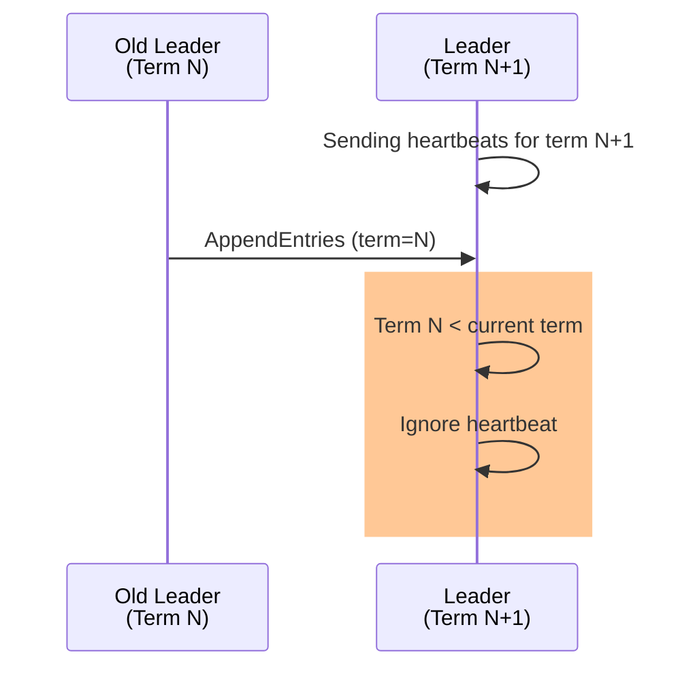

# Test Case 27: Leader Ignores Lower Term Heartbeat

**Given:** you are a leader
**When:** you receive a heartbeat of a lower term
**Then:** you ignore it

## Diagram

```mermaid
sequenceDiagram
    participant OldLeader as Old Leader<br/>(Term N)
    participant Leader as Leader<br/>(Term N+1)
    
    Leader->>Leader: Sending heartbeats for term N+1
    OldLeader->>Leader: AppendEntries (term=N)
    rect rgb(255, 200, 150)
        Leader->>Leader: Term N < current term
        Leader->>Leader: Ignore heartbeat
    end
```
