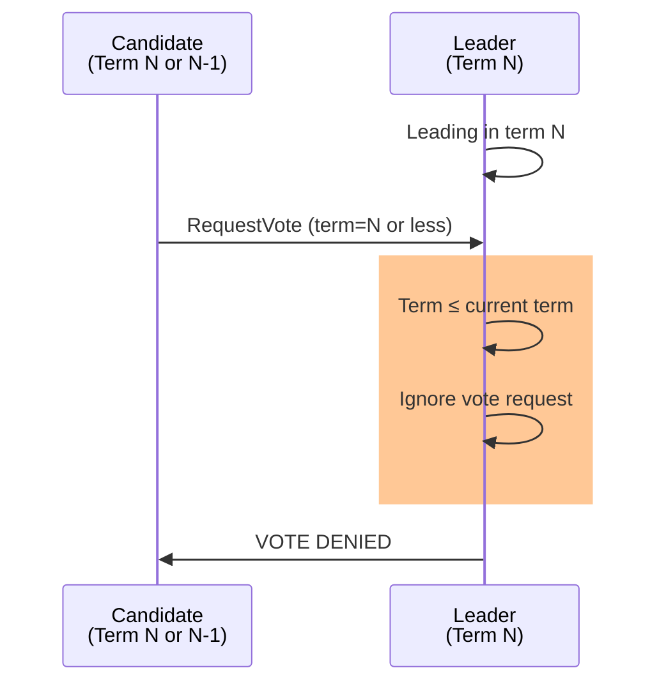

# Test Case 28: Leader Ignores Low or Equal Term Vote Request

**Given:** you are a leader
**When:** you receive a request for vote for current or lower term
**Then:** you ignore it

## Diagram

```mermaid
sequenceDiagram
    participant Candidate as Candidate<br/>(Term N or N-1)
    participant Leader as Leader<br/>(Term N)
    
    Leader->>Leader: Leading in term N
    Candidate->>Leader: RequestVote (term=N or less)
    rect rgb(255, 200, 150)
        Leader->>Leader: Term ≤ current term
        Leader->>Leader: Ignore vote request
    end
    Leader->>Candidate: VOTE DENIED
```
